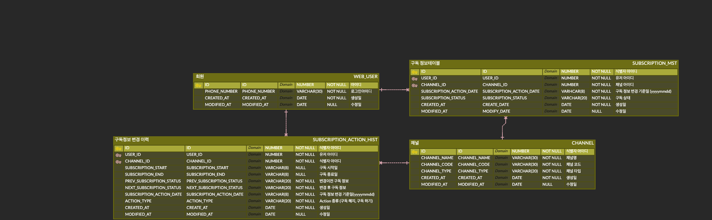

### WEB_USER

| Column Name    | Data Type  | Nullable | Description          |
|----------------|------------|----------|----------------------|
| ID             | NUMBER     | NO       | 아이디               |
| PHONE_NUMBER   | VARCHAR(30)| NO       | 로그인아이디         |
| CREATED_AT     | DATE       | NO       | 생성일               |
| MODIFIED_AT    | DATE       | YES      | 수정일               |

---

### CHANNEL

| Column Name    | Data Type  | Nullable | Description          |
|----------------|------------|----------|----------------------|
| ID             | NUMBER     | NO       | 식별자 아이디        |
| CHANNEL_NAME   | VARCHAR(30)| NO       | 채널명               |
| CHANNEL_CODE   | VARCHAR(30)| NO       | 채널 코드            |
| CHANNEL_TYPE   | VARCHAR(20)| NO       | 채널 타입            |
| CREATED_AT     | DATE       | NO       | 생성일               |
| MODIFIED_AT    | DATE       | YES      | 수정일               |

CHANNEL_NAME: 캐비지, 당근마켓 알바. 케어위드 ...  
CHANNEL_CODE: 고유 채널 코드 ex) CARROT, CABBAGE ...   
CHANNEL_TYPE: BOTH(구독, 해지 둘가 가능), SUBSCRIPTION_ONLY(구독 만 가능), CANCELLATION_ONLY(해지만 가능)  

---

### SUBSCRIPTION_MST

| Column Name                 | Data Type  | Nullable | Description                     |
|-----------------------------|------------|----------|---------------------------------|
| ID                          | NUMBER     | NO       | 식별자 아이디                   |
| USER_ID                     | NUMBER     | NO       | 유저 아이디                     |
| CHANNEL_ID                  | NUMBER     | NO       | 채널 아이디                     |
| SUBSCRIPTION_ACTION_DATE    | VARCHAR(8) | NO       | 구독 정보 변경 기준일 (yyyymmdd)|
| SUBSCRIPTION_STATUS         | VARCHAR(20)| NO       | 구독 상태                       |
| CREATE_DATE                 | DATE       | NO       | 생성일                          |
| MODIFY_DATE                 | DATE       | YES      | 수정일                          |

SUBSCRIPTION_ACTION_DATE : 구독 정보가 변경된 기준일에 대한 날짜를 저장하는 컬럼 yyyymmdd 형식으로 저장  
SUBSCRIPTION_STATUS : 구독안함, 구독중, 프리미엄 구독 상태를 저장.  

---

### SUBSCRIPTION_ACTION_HIST

| Column Name                 | Data Type  | Nullable | Description                          |
|-----------------------------|------------|----------|--------------------------------------|
| ID                          | NUMBER     | NO       | 식별자 아이디                        |
| USER_ID                     | NUMBER     | NO       | 유저 아이디                          |
| CHANNEL_ID                  | NUMBER     | NO       | 식별자 아이디                        |
| SUBSCRIPTION_START          | VARCHAR(8) | YES      | 구독 시작일                          |
| SUBSCRIPTION_END            | VARCHAR(8) | YES      | 구독 종료일                          |
| PREV_SUBSCRIPTION_STATUS    | VARCHAR(20)| NO       | 변경이전 구독 정보                   |
| NEXT_SUBSCRIPTION_STATUS    | VARCHAR(20)| NO       | 변경 후 구독 정보                   |
| SUBSCRIPTION_ACTION_DATE    | VARCHAR(8) | NO       | 구독 정보 변경 기준일 (yyyymmdd)     |
| ACTION_TYPE                 | VARCHAR(20)| NO       | Action 종류 (구독 해지, 구독 하기)   |
| CREATE_AT                   | DATE       | NO       | 생성일                               |
| MODIFIED_AT                 | DATE       | YES      | 수정일                               |

SUBSCRIPTION_START : 구독하기를 최초 진행한 날짜를 저장  
SUBSCRIPTION_END : 구독이 종료된 최종 날짜를 저장  
PREV_SUBSCRIPTION_STATUS : 변경 전 구독 상태를 저장  
NEXT_SUBSCRIPTION_STATUS: 변경 후 구독 상태를 저장   
SUBSCRIPTION_ACTION_DATE: 구독 정보가 변경된 날짜를 저장  
ACTION_TYPE : 구독 해지, 구독 하기 정보를 저장 하는 컬럼  

---
